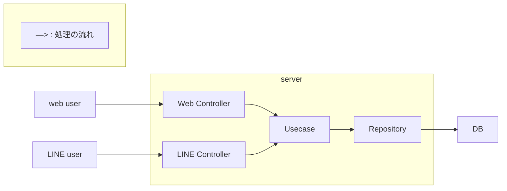

# LogBook

## 1. 概要（Overview）

Logbook は、筋トレをもっと続けやすくするために
LINE と Web の両方から簡単にトレーニング記録ができるアプリです。

- LINE Bot で手軽に記録ワークアウトの開始・終了、セットの追加などの操作をスマホからすぐに入力できます。
- Web から詳細管理 LINE Login（OAuth 2.0 + PKCE）でログインすると、PC / スマホのブラウザからより細かい履歴管理や編集ができます。

本アプリは OAuth や API 設計、Redis/DB の扱い、Go のバックエンド開発を体系的に学ぶために開発しました。

今後は 自分のトレーニングを継続的に管理する実用アプリとして育てていく予定です。

## 2. 開発の背景・目的（Motivation）

初心者でも筋トレを継続できるように、**「できるだけ簡単に続けられる記録ツール」** を作りたいという思いで開発を始めました。

市販アプリは入力項目が多かったり UI が重かったりして、  
**「トレーニング中にサッと入力できない」** という不満がありました。  
そこで、日常的に使っている **LINE だけで最低限の記録が完了する仕組み** を自分で作ることにしました。

さらに、同時に以下の技術を学ぶ目的もありました。

- OAuth2 + PKCE を用いた実践的な LINE ログイン
- Go 言語での Web API / LINE Bot 開発
- Redis を用いた状態管理
- LINE と Web の二つのクライアントから同じ API を扱う設計
- 将来的なデプロイに向けた AWS（EC2, RDS, CloudFront）構成の検証
- クリーンアーキテクチャを用いた設計

これらを一つのアプリとしてまとめることで、

- 「筋トレを習慣化したい」という個人的な目的
- 「バックエンド・インフラ技術を体系的に学びたい」という技術的目的

の両方を満たすことを目指しています。

## 3. デモ（Demo）

## 4. 主な特徴（Features）

### 1. LINE だけでサクッと記録

- 「開始」「追加」「終了」のボタンで操作
- 種目はボタンで選択、重量・回数はメッセージで入力
- トレ中でも数秒で記録できるように最小限のフローに

### 2. Web は LINE ログインでワンタップ

- 「LINE でログイン」ボタンだけで認証
- パスワード管理なしで、自分の記録ページへ飛べる
- プロフィール情報はセッション Cookie で管理

### 3. Web で詳細な振り返り

- 過去のワークアウト一覧を表示
- セットごとの重量・回数など詳細を確認
- （今後）グラフや集計で進捗を見える化予定

### 4. Redis で LINE 会話のステート管理

- 「今は種目入力中」「今は重量入力中」などの状態を Redis に保存
- ユーザーが送ったメッセージを、状態に応じて「種目 ID」「重量」「回数」として解釈
- すべて揃った時点で DB に WorkoutSet を保存

### 5. Web と LINE でロジック共通

- Web / LINE どちらも同じ Usecase / Repository を利用
- 入口（UI）は違っても、中身のビジネスロジックは共通
- 将来的にクライアントを増やしても拡張しやすい構成

## 5. 技術スタック（Tech Stack）

- **言語 / フレームワーク**

  - Go (Echo)
  - React + Vite

- **認証 / 連携**

  - LINE Login（OAuth2 + PKCE）
  - LINE Messaging API（Bot）

- **データ**

  - PostgreSQL（本番データ）
  - Redis（LINE の会話ステート）

- **その他**
  - Docker / docker-compose（開発環境）
  - ngrok（Webhook 開発）
  - Terraform（インフラ管理予定）

## 6. アーキテクチャ（Architecture）

Logbook は Web（React）と LINE Bot の 2 つの入口を持ちながらも、内部はひとつの共通サーバー（Clean Architecture）で動作しています。これにより、UI が違っても同じビジネスロジックを利用でき、拡張性と保守性を重視した設計になっています。

### 全体構成の考え方

- UI（Web / LINE）
  - Web：LINE OAuth でログインし、管理画面や記録の閲覧
  - LINE：ボタン操作（postback）で記録の追加
- Controller
  - Web と LINE それぞれのリクエストを受け取る入り口
- Usecase（ビジネスロジック）
  - 記録の追加、種目の管理、履歴の取得などを共通化
- Repository（永続化）
  - DB の読み書きを担当し、Domain モデルを扱う
- DB
  - ユーザー / 種目 / ワークアウト / セットなどのデータを管理

UI は違っても「Controller → Usecase → Repository → DB」の流れは同じで、機能追加や修正が 1 箇所で済むようにしています。

### メリット

- Web/LINE の両対応でもロジックは共通
- 新しい UI（スマホアプリなど）を追加しやすい
- テストしやすく、保守性が高い
- ビジネスロジックが UI に依存しない



## 7. 実行方法（How to Run）

### ローカル開発（Web + LINE Bot）

ローカル開発では、バックエンド・フロントエンド・LINE 設定の 3 つを整えれば動作します。

#### 1. ngrok でバックエンド（3000 番）を公開

```bash
ngrok http 3000
```

→ 表示された `https://xxxxx.ngrok-free.app` を控えておく。

#### 2. 環境変数を設定（重要）

フロントエンド・バックエンドの `.env` に ngrok の URL を設定する。
特に LINE OAuth のコールバックは以下の形式で必ず https を使う。

```bash
LINE_REDIRECT_URI=https://xxxxx.ngrok-free.app/api/auth/line/callback
```

#### 3. Docker（DB など）を起動

```bash
docker compose up -d
```

#### 4. DB マイグレーション

```bash
cd backend
go run cmd/migrate/migrate.go
```

#### 5. 初期データ投入（必要な場合）

```bash
cd backend
go run cmd/seed/seed.go
```

#### 6. バックエンドを起動

```bash
cd backend
go run cmd/api/main.go
```

#### 7. フロントエンドを起動

```bash
cd frontend
npm run dev
```

以上で、LINE Bot と Web アプリの両方がローカル環境で動作する。
フロントはブラウザで開き、LINE 側には Webhook URL と Callback URL を ngrok の URL で設定すること。

## 8. 工夫した点 / こだわり（Key Points）

- ○○ の設定をあらかじめ整備
- △△ によって型安全性を強化
- シンプルな構成で学習しやすい
- 拡張しやすいフォルダ構成を採用

## 9. 今後の改善予定（Future Improvements）

- △△ に対応
- もっと汎用的に使えるよう拡張
- コメントやドキュメントの充実
- 設定の自動化など
