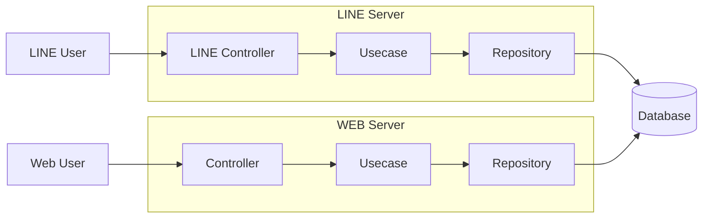
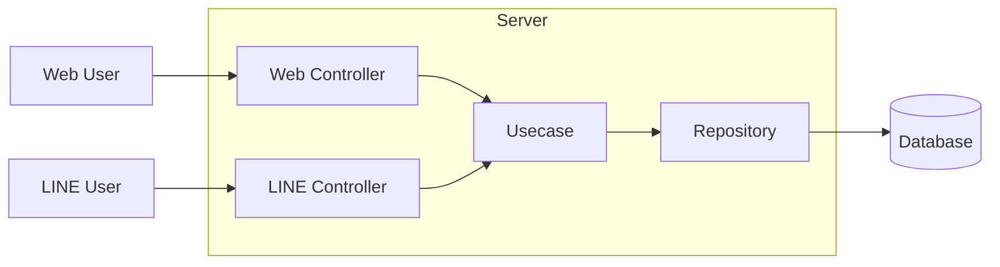

# アーキテクチャ

### Web と LINE が別々に存在していた構成（Before）

Web アプリと LINE Bot をそれぞれ別サーバーとして構成しており、
両者が個別にロジックやデータアクセスを持っている状態。

### サーバーを統一し、ロジックを共通化した構成（After）

クリーンアーキテクチャを採用し、Controller のみチャネル別、
Usecase・Repository を 1 つに統一することで、ロジックとデータを一元管理

