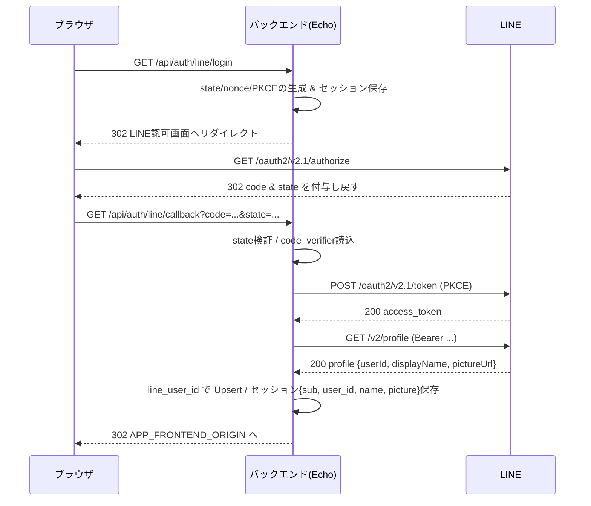
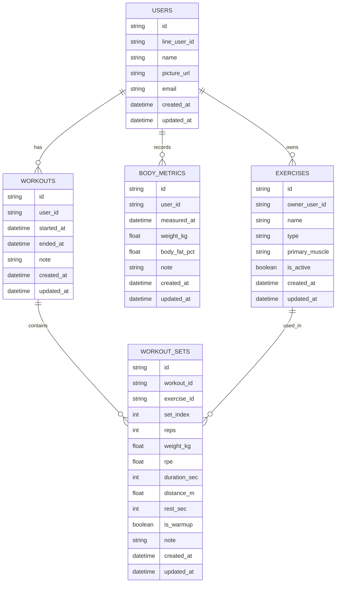

# Logbook バックエンド ドキュメント

本書は Logbook のバックエンドについて、API 仕様、DB テーブル設計（ER 図を含む）、および認証シーケンスをまとめたものです。

## 概要

- ベース URL: `/api`（ヘルスチェックは `/healthz`）
- 認証: Cookie ベースのセッション（LINE Login）。業務系エンドポイントは原則ログイン必須。
- CORS: `APP_FRONTEND_ORIGIN` のみ許可、`credentials: true`。
- セッションクッキー: `HttpOnly` / `Secure` / `SameSite=None` / `MaxAge=86400`。

主要な環境変数（抜粋）:
- `LINE_CHANNEL_ID`, `LINE_CHANNEL_SECRET`, `LINE_REDIRECT_URI`
- `APP_FRONTEND_ORIGIN`, `APP_SESSION_SECRET`, `ADDR`
- `POSTGRES_USER`, `POSTGRES_PW`, `POSTGRES_HOST`, `POSTGRES_PORT`, `POSTGRES_DB`

コード参照:
- ルーター: `backend/router/router.go:1`
- モデル: `backend/models/*.go:1`
- マイグレーション: `backend/cmd/migrate/migrate.go:1`

---

## 認証（LINE Login）

- ログイン開始: `GET /api/auth/line/login`
  - セッションに `state`, `nonce`, `code_verifier` を保存して LINE 認可へ 302 リダイレクト
- コールバック: `GET /api/auth/line/callback`
  - 認可コードをアクセストークンへ交換、プロフィール取得、ユーザーを Upsert、セッション確立後フロントへ 302 リダイレクト
- ログイン中ユーザー: `GET /api/me`（未ログインは 401）
- ログアウト: `GET /api/logout`（セッション破棄しフロントへ 302）

セッションに保存する主な値:
- `sub`: LINE のユーザーID（`/api/me` 用）
- `user_id`: アプリ内のユーザーID（権限制御・所有チェックに使用）
- `name`, `picture`: 表示名・アイコン URL

### 認証シーケンス図

補足:
- フロントと別オリジンのため Cookie は `Secure` + `SameSite=None`。
- API 側は `session["user_id"]` を読み取り、所有者チェックを行います。

---

## API 一覧

特記ない限り、以下は認証必須（未認証は 401）。

### ヘルスチェック
- GET `/healthz`
  - 200: `ok`（認証不要）

### 認証・ユーザー
- GET `/api/me`
  - 200: `{ provider: "line", userId: string, name?: string, picture?: string, statusMessage: string }`
  - 401: 未認証
- GET `/api/auth/line/login`
  - 302: LINE 認可へリダイレクト
- GET `/api/auth/line/callback`
  - 302: セッション確立後フロントへリダイレクト
- GET `/api/logout`
  - 302: セッション破棄後フロントへ

### Workouts（トレーニングセッション）
- POST `/api/workouts`
  - Body: `{ startedAt: RFC3339, note?: string }`
  - 201: `Workout`
- PATCH `/api/workouts/:id`
  - Body: `{ startedAt?: RFC3339, endedAt?: RFC3339, note?: string|null }`
  - 200: `Workout`（所有者のみ）、見つからない/権限なしは 404 相当
- PATCH `/api/workouts/:id/end`
  - Body: `{ endedAt?: RFC3339 }`（未指定ならサーバ時刻）
  - 200: `Workout`
- DELETE `/api/workouts/:id`
  - 204: 削除成功
- GET `/api/workouts`
  - Query: `from?: RFC3339`, `to?: RFC3339`, `limit?: 1..200`, `offset?: >=0`
  - 200: `{ items: Workout[], total: number, limit: number, offset: number }`
- GET `/api/workouts/:id/detail`
  - 200: `{ workout: Workout, sets: WorkoutSet[] }`（所有者のみ）。なければ 404

### Workout Sets（セット）
- POST `/api/workouts/:workoutId/sets`
  - Body: `{
      exerciseId: uuid,
      setIndex: number,
      reps?: number,
      weightKg?: number,
      rpe?: number,
      isWarmup: boolean,
      restSec?: number,
      note?: string|null,
      durationSec?: number,
      distanceM?: number
    }`
  - 201: `WorkoutSet`
- PATCH `/api/workout_sets/:setId`
  - Body: 上記フィールドの任意（パーシャル更新）
  - 200: 更新後 `WorkoutSet`
- DELETE `/api/workout_sets/:setId`
  - 204: 削除成功

### Exercises（種目）
- GET `/api/exercises`
  - Query: `q?: string`, `type?: strength|cardio|other`, `onlyMine?: true|false`, `limit?: number`, `offset?: number`
  - 200: `{ items: Exercise[], total: number, limit: number, offset: number }`
- GET `/api/exercises/:id`
  - 200: `Exercise`（グローバル or 自分の独自）、該当なしは 404
- POST `/api/exercises`
  - Body: `{ name: string, type: "strength"|"cardio"|"other", primaryMuscle?: string }`
  - 201: 作成された `Exercise`（所有者は自分）
- PATCH `/api/exercises/:id`
  - Body: `{ name?: string, type?: "strength"|"cardio"|"other", primaryMuscle?: string|null, isActive?: boolean }`
  - 200: 更新後 `Exercise`（自分の所有のみ）、それ以外は 404
- DELETE `/api/exercises/:id`
  - 204: 自分の所有のみ削除可。該当なしは 404

### Body Metrics（体組成）
- GET `/api/body_metrics`
  - Query: `from?: RFC3339`, `to?: RFC3339`, `limit?: number`, `offset?: number`
  - 200: `{ items: BodyMetric[], total: number, limit: number, offset: number }`
- POST `/api/body_metrics`
  - Body: `{ measuredAt: RFC3339, weightKg: number, bodyFatPct?: number, note?: string }`
  - 201: `BodyMetric`
- PATCH `/api/body_metrics/:id`
  - Body: `{ measuredAt?: RFC3339, weightKg?: number, bodyFatPct?: number|null, note?: string|null }`
  - 200: 更新後 `BodyMetric`（自分の所有のみ）、該当なしは 404
- DELETE `/api/body_metrics/:id`
  - 204: 削除成功

モデルの JSON 形状は各構造体のタグに準拠:
- `backend/models/workout.go:1`
- `backend/models/workout_set.go:1`
- `backend/models/exercise.go:1`
- `backend/models/body_metric.go:1`

---

## DB 設計

- RDBMS: PostgreSQL
- ORM: GORM（AutoMigrate 使用）。UUID 主キーは `gen_random_uuid()` をデフォルト想定。

テーブルと主な列（簡略）:
- `users`
  - `id uuid PK`, `line_user_id text UNIQUE NOT NULL`, `name text?`, `picture_url text?`, `email text?`, `created_at`, `updated_at`
- `exercises`
  - `id uuid PK`, `owner_user_id uuid NULL`, `name text NOT NULL`, `type text NOT NULL`, `primary_muscle text?`, `is_active bool DEFAULT true`, `created_at`, `updated_at`
  - 一意制約の推奨: グローバル（`owner_user_id IS NULL`）では `name` を一意、独自種目は `(owner_user_id, name)` を一意
- `workouts`
  - `id uuid PK`, `user_id uuid NOT NULL`, `started_at timestamptz NOT NULL`, `ended_at timestamptz?`, `note text?`, `created_at`, `updated_at`
- `workout_sets`
  - `id uuid PK`, `workout_id uuid NOT NULL`, `exercise_id uuid NOT NULL`, `set_index int NOT NULL`, 各種メトリクス（`reps`, `weight_kg`, `rpe`, `duration_sec`, `distance_m`, `rest_sec`, `is_warmup`, `note`）、`created_at`, `updated_at`
- `body_metrics`
  - `id uuid PK`, `user_id uuid NOT NULL`, `measured_at timestamptz NOT NULL`, `weight_kg real NOT NULL`, `body_fat_pct real?`, `note text?`, `created_at`, `updated_at`
  - 一意制約の推奨: `(user_id, measured_at)`

### テーブル定義（詳細）

以下はモデル実装に基づく詳細な列定義です（NULL 可否/デフォルト/索引）。

Users（`users`）

| 列名 | 型 | NULL | デフォルト | インデックス/制約 | 説明 |
|---|---|---|---|---|---|
| id | uuid | NO | gen_random_uuid() | PK | 内部ユーザーID |
| line_user_id | text(varchar(128)想定) | NO | — | UNIQUE | LINEのユーザーID（sub） |
| name | text(varchar(100)) | YES | — | — | 表示名（オプション） |
| picture_url | text(varchar(2048)) | YES | — | — | アイコンURL |
| email | text(varchar(255)) | YES | — | — | メール（未使用/任意） |
| created_at | timestamptz | NO | now() | — | 作成時刻 |
| updated_at | timestamptz | NO | now() | — | 更新時刻 |

Exercises（`exercises`）

| 列名 | 型 | NULL | デフォルト | インデックス/制約 | 説明 |
|---|---|---|---|---|---|
| id | uuid | NO | gen_random_uuid() | PK | 種目ID |
| owner_user_id | uuid | YES | — | INDEX | 所有者（NULLはグローバル） |
| name | text(varchar(64)) | NO | — | UNIQUE(条件付) | 種目名 |
| type | text | NO | — | — | strength/cardio/other |
| primary_muscle | text(varchar(64)) | YES | — | — | 主働筋（任意） |
| is_active | bool | NO | true | — | 有効フラグ |
| created_at | timestamptz | NO | now() | — | 作成時刻 |
| updated_at | timestamptz | NO | now() | — | 更新時刻 |

推奨一意制約:
- グローバル行: `owner_user_id IS NULL` かつ `name` の一意
- 独自種目: `UNIQUE(owner_user_id, name)`

Workouts（`workouts`）

| 列名 | 型 | NULL | デフォルト | インデックス/制約 | 説明 |
|---|---|---|---|---|---|
| id | uuid | NO | gen_random_uuid() | PK | ワークアウトID |
| user_id | uuid | NO | — | INDEX(FK) | 所有ユーザー |
| started_at | timestamptz | NO | — | INDEX(推奨) | 開始時刻 |
| ended_at | timestamptz | YES | — | — | 終了時刻 |
| note | text | YES | — | — | メモ |
| created_at | timestamptz | NO | now() | — | 作成時刻 |
| updated_at | timestamptz | NO | now() | — | 更新時刻 |

Workout Sets（`workout_sets`）

| 列名 | 型 | NULL | デフォルト | インデックス/制約 | 説明 |
|---|---|---|---|---|---|
| id | uuid | NO | gen_random_uuid() | PK | セットID |
| workout_id | uuid | NO | — | INDEX(FK), 複合idx | 親ワークアウト |
| exercise_id | uuid | NO | — | INDEX(FK) | 使用種目 |
| set_index | int | NO | 0 | 複合idx(workout_id,set_index) | セット順序 |
| reps | int | YES | — | — | 回数（任意） |
| weight_kg | real | YES | — | — | 重量（kg） |
| rpe | real | YES | — | — | RPE（0〜10想定） |
| duration_sec | int | YES | — | — | 有酸素：時間（秒） |
| distance_m | real | YES | — | — | 有酸素：距離（m） |
| rest_sec | int | YES | — | — | 休憩時間（秒） |
| is_warmup | bool | NO | false | — | ウォームアップか |
| note | text | YES | — | — | メモ |
| created_at | timestamptz | NO | now() | — | 作成時刻 |
| updated_at | timestamptz | NO | now() | — | 更新時刻 |

Body Metrics（`body_metrics`）

| 列名 | 型 | NULL | デフォルト | インデックス/制約 | 説明 |
|---|---|---|---|---|---|
| id | uuid | NO | gen_random_uuid() | PK | 体組成ID |
| user_id | uuid | NO | — | INDEX(FK) | 所有ユーザー |
| measured_at | timestamptz | NO | — | INDEX, UNIQUE(user_id, measured_at)推奨 | 計測時刻 |
| weight_kg | real | NO | — | — | 体重(kg) |
| body_fat_pct | real | YES | — | — | 体脂肪率(%) |
| note | text | YES | — | — | メモ |
| created_at | timestamptz | NO | now() | — | 作成時刻 |
| updated_at | timestamptz | NO | now() | — | 更新時刻 |

外部キーの意図（AutoMigrate では明示的に張られない場合あり。必要に応じて手動付与）:
- `workouts.user_id` → `users.id`
- `workout_sets.workout_id` → `workouts.id`
- `workout_sets.exercise_id` → `exercises.id`
- `exercises.owner_user_id` → `users.id`（NULL 可）
- `body_metrics.user_id` → `users.id`

### ER 図（Mermaid）

### マイグレーション

- エントリポイント: `backend/cmd/migrate/migrate.go:1`
- `gen_random_uuid()` を利用するため `pgcrypto` 拡張の有効化を推奨。
- 実行例（`backend` ディレクトリ配下）:
  - ビルド: `go build ./cmd/migrate`
  - 実行: `./migrate`

---

## 備考

- 認可はリポジトリ層で `session["user_id"]` とレコードの所有者を突き合わせて担保。
- 現状、エラー詳細は最小限（404/403 の厳密な出し分けは今後調整余地あり）。
- `docs/db/` 以下の SchemaSpy 出力は古い可能性があります。本ドキュメントは現在の Go 実装（ルーター/モデル）に基づきます。
