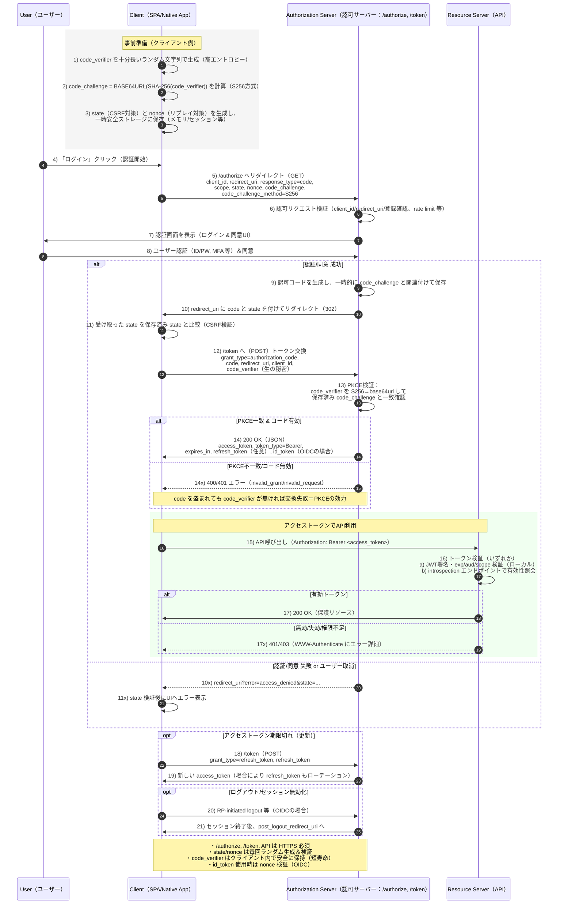

# Logbook バックエンド ドキュメント

本書は Logbook のバックエンドについて、API 仕様、DB テーブル設計（ER 図を含む）、および認証シーケンスをまとめたものです。

## 概要

- ベース URL: `/api`（ヘルスチェックは `/healthz`）
- 認証: Cookie ベースのセッション（LINE Login）。業務系エンドポイントは原則ログイン必須。
- CORS: `APP_FRONTEND_ORIGIN` のみ許可、`credentials: true`。
- セッションクッキー: `HttpOnly` / `Secure` / `SameSite=None` / `MaxAge=86400`。

主要な環境変数（抜粋）:

- `LINE_CHANNEL_ID`, `LINE_CHANNEL_SECRET`, `LINE_REDIRECT_URI`
- `APP_FRONTEND_ORIGIN`, `APP_SESSION_SECRET`, `ADDR`
- `POSTGRES_USER`, `POSTGRES_PW`, `POSTGRES_HOST`, `POSTGRES_PORT`, `POSTGRES_DB`

コード参照:

- ルーター: `backend/router/router.go:1`
- モデル: `backend/models/*.go:1`
- マイグレーション: `backend/cmd/migrate/migrate.go:1`

---

## 認証（LINE Login）

- ログイン開始: `GET /api/auth/line/login`
  - セッションに `state`, `nonce`, `code_verifier` を保存して LINE 認可へ 302 リダイレクト
- コールバック: `GET /api/auth/line/callback`
  - 認可コードをアクセストークンへ交換、プロフィール取得、ユーザーを Upsert、セッション確立後フロントへ 302 リダイレクト
- ログイン中ユーザー: `GET /api/me`（未ログインは 401）
- ログアウト: `GET /api/logout`（セッション破棄しフロントへ 302）

セッションに保存する主な値:

- `sub`: LINE のユーザー ID（`/api/me` 用）
- `user_id`: アプリ内のユーザー ID（権限制御・所有チェックに使用）
- `name`, `picture`: 表示名・アイコン URL

### 認証シーケンス図

補足:

- フロントと別オリジンのため Cookie は `Secure` + `SameSite=None`。
- API 側は `session["user_id"]` を読み取り、所有者チェックを行います。

---

モデルの JSON 形状は各構造体のタグに準拠:

- `backend/models/workout.go:1`
- `backend/models/workout_set.go:1`
- `backend/models/exercise.go:1`
- `backend/models/body_metric.go:1`

### API 一覧（表）

認証は「必須/不要/署名」。レスポンスは JSON、日時は RFC3339。

| Method | Path                            | Auth | Request（Body/Query/Path）                             | Response                                | 説明                                                 |
| ------ | ------------------------------- | ---- | ------------------------------------------------------ | --------------------------------------- | ---------------------------------------------------- |
| GET    | `/healthz`                      | 不要 | —                                                      | `ok`                                    | ヘルスチェック                                       |
| GET    | `/api/me`                       | 必須 | —                                                      | `{ provider, userId, name?, picture? }` | 現在ユーザー情報                                     |
| GET    | `/api/auth/line/login`          | 不要 | —                                                      | 302 Redirect                            | LINE 認可へリダイレクト                              |
| GET    | `/api/auth/line/callback`       | 不要 | `?code&state`                                          | 302 Redirect                            | セッション確立 → フロントへ                          |
| GET    | `/api/logout`                   | 必須 | —                                                      | 302 Redirect                            | セッション破棄                                       |
| POST   | `/api/workouts`                 | 必須 | Body: `{ startedAt, note? }`                           | `Workout`                               | ワークアウト作成                                     |
| PATCH  | `/api/workouts/:id`             | 必須 | Body: `{ startedAt?, endedAt?, note? }`                | `Workout`                               | 更新                                                 |
| PATCH  | `/api/workouts/:id/end`         | 必須 | Body: `{ endedAt? }`                                   | `Workout`                               | 終了時間を設定                                       |
| DELETE | `/api/workouts/:id`             | 必須 | —                                                      | 204                                     | 削除（本人のみ）                                     |
| GET    | `/api/workouts`                 | 必須 | Query: `from?,to?,limit?,offset?`                      | `{ items[], total, limit, offset }`     | 一覧（本人）                                         |
| GET    | `/api/workouts/:id/detail`      | 必須 | —                                                      | `{ workout, sets[] }`                   | 詳細（本人）                                         |
| POST   | `/api/workouts/:workoutId/sets` | 必須 | Body: `WorkoutSetCreateInput`                          | `WorkoutSet`                            | セット追加                                           |
| PATCH  | `/api/workout_sets/:setId`      | 必須 | Body: `WorkoutSetUpdateInput`                          | `WorkoutSet`                            | セット更新                                           |
| DELETE | `/api/workout_sets/:setId`      | 必須 | —                                                      | 204                                     | セット削除                                           |
| GET    | `/api/exercises`                | 必須 | Query: `q?,type?,onlyMine?,limit?,offset?`             | `{ items[], total, limit, offset }`     | 種目一覧（可視範囲）                                 |
| GET    | `/api/exercises/:id`            | 必須 | —                                                      | `Exercise`                              | 取得（可視範囲）                                     |
| POST   | `/api/exercises`                | 必須 | Body: `{ name, type, primaryMuscle? }`                 | `Exercise`                              | 自分の独自種目作成                                   |
| PATCH  | `/api/exercises/:id`            | 必須 | Body: `{ name?, type?, primaryMuscle?, isActive? }`    | `Exercise`                              | 自分の独自種目更新                                   |
| DELETE | `/api/exercises/:id`            | 必須 | —                                                      | 204                                     | 自分の独自種目削除                                   |
| GET    | `/api/body_metrics`             | 必須 | Query: `from?,to?,limit?,offset?`                      | `{ items[], total, limit, offset }`     | 体組成一覧（本人）                                   |
| POST   | `/api/body_metrics`             | 必須 | Body: `{ measuredAt, weightKg, bodyFatPct?, note? }`   | `BodyMetric`                            | 体組成作成                                           |
| PATCH  | `/api/body_metrics/:id`         | 必須 | Body: `{ measuredAt?, weightKg?, bodyFatPct?, note? }` | `BodyMetric`                            | 体組成更新                                           |
| DELETE | `/api/body_metrics/:id`         | 必須 | —                                                      | 204                                     | 体組成削除                                           |
| POST   | `/line/webhook`                 | 署名 | LINE 署名ヘッダ                                        | 200/204                                 | ボタン/メッセージ受付（Adapter で Usecase 呼び出し） |

### LINE ボタン/ポストバック設計（案）

| action    | params 例                                    | 呼び出す Usecase                                                   | 備考                                              |
| --------- | -------------------------------------------- | ------------------------------------------------------------------ | ------------------------------------------------- |
| `start`   | —                                            | `WorkoutUsecase.Create(userID, { startedAt: now })`                | 記録開始                                          |
| `end`     | —                                            | `WorkoutUsecase.End(workoutID, userID, now)`                       | 進行中の最新を終了（取得方法は Usecase 側で定義） |
| `add_set` | `exerciseId=...,reps=...,weight=...,rpe=...` | `WorkoutSetUsecase.AddSet(userID, workoutID, input)`               | セット追加（UI で段階入力でも可）                 |
| `today`   | —                                            | `WorkoutUsecase.ListByUser(userID, { from: today, to: tomorrow })` | 今日の記録を返信                                  |

---

## DB 設計

- RDBMS: PostgreSQL
- ORM: GORM（AutoMigrate 使用）。UUID 主キーは `gen_random_uuid()` をデフォルト想定。

テーブルと主な列（簡略）:

- `users`
  - `id uuid PK`, `line_user_id text UNIQUE NOT NULL`, `name text?`, `picture_url text?`, `email text?`, `created_at`, `updated_at`
- `exercises`
  - `id uuid PK`, `owner_user_id uuid NULL`, `name text NOT NULL`, `type text NOT NULL`, `primary_muscle text?`, `is_active bool DEFAULT true`, `created_at`, `updated_at`
  - 一意制約の推奨: グローバル（`owner_user_id IS NULL`）では `name` を一意、独自種目は `(owner_user_id, name)` を一意
- `workouts`
  - `id uuid PK`, `user_id uuid NOT NULL`, `started_at timestamptz NOT NULL`, `ended_at timestamptz?`, `note text?`, `created_at`, `updated_at`
- `workout_sets`
  - `id uuid PK`, `workout_id uuid NOT NULL`, `exercise_id uuid NOT NULL`, `set_index int NOT NULL`, 各種メトリクス（`reps`, `weight_kg`, `rpe`, `duration_sec`, `distance_m`, `rest_sec`, `is_warmup`, `note`）、`created_at`, `updated_at`
- `body_metrics`
  - `id uuid PK`, `user_id uuid NOT NULL`, `measured_at timestamptz NOT NULL`, `weight_kg real NOT NULL`, `body_fat_pct real?`, `note text?`, `created_at`, `updated_at`
  - 一意制約の推奨: `(user_id, measured_at)`

### テーブル定義（詳細）

以下はモデル実装に基づく詳細な列定義です（NULL 可否/デフォルト/索引）。

Users（`users`）

| 列名         | 型                     | NULL | デフォルト        | インデックス/制約 | 説明                      |
| ------------ | ---------------------- | ---- | ----------------- | ----------------- | ------------------------- |
| id           | uuid                   | NO   | gen_random_uuid() | PK                | 内部ユーザー ID           |
| line_user_id | text(varchar(128)想定) | NO   | —                 | UNIQUE            | LINE のユーザー ID（sub） |
| name         | text(varchar(100))     | YES  | —                 | —                 | 表示名（オプション）      |
| picture_url  | text(varchar(2048))    | YES  | —                 | —                 | アイコン URL              |
| email        | text(varchar(255))     | YES  | —                 | —                 | メール（未使用/任意）     |
| created_at   | timestamptz            | NO   | now()             | —                 | 作成時刻                  |
| updated_at   | timestamptz            | NO   | now()             | —                 | 更新時刻                  |

Exercises（`exercises`）

| 列名           | 型                | NULL | デフォルト        | インデックス/制約 | 説明                        |
| -------------- | ----------------- | ---- | ----------------- | ----------------- | --------------------------- |
| id             | uuid              | NO   | gen_random_uuid() | PK                | 種目 ID                     |
| owner_user_id  | uuid              | YES  | —                 | INDEX             | 所有者（NULL はグローバル） |
| name           | text(varchar(64)) | NO   | —                 | UNIQUE(条件付)    | 種目名                      |
| type           | text              | NO   | —                 | —                 | strength/cardio/other       |
| primary_muscle | text(varchar(64)) | YES  | —                 | —                 | 主働筋（任意）              |
| is_active      | bool              | NO   | true              | —                 | 有効フラグ                  |
| created_at     | timestamptz       | NO   | now()             | —                 | 作成時刻                    |
| updated_at     | timestamptz       | NO   | now()             | —                 | 更新時刻                    |

推奨一意制約:

- グローバル行: `owner_user_id IS NULL` かつ `name` の一意
- 独自種目: `UNIQUE(owner_user_id, name)`

Workouts（`workouts`）

| 列名       | 型          | NULL | デフォルト        | インデックス/制約 | 説明            |
| ---------- | ----------- | ---- | ----------------- | ----------------- | --------------- |
| id         | uuid        | NO   | gen_random_uuid() | PK                | ワークアウト ID |
| user_id    | uuid        | NO   | —                 | INDEX(FK)         | 所有ユーザー    |
| started_at | timestamptz | NO   | —                 | INDEX(推奨)       | 開始時刻        |
| ended_at   | timestamptz | YES  | —                 | —                 | 終了時刻        |
| note       | text        | YES  | —                 | —                 | メモ            |
| created_at | timestamptz | NO   | now()             | —                 | 作成時刻        |
| updated_at | timestamptz | NO   | now()             | —                 | 更新時刻        |

Workout Sets（`workout_sets`）

| 列名         | 型          | NULL | デフォルト        | インデックス/制約              | 説明               |
| ------------ | ----------- | ---- | ----------------- | ------------------------------ | ------------------ |
| id           | uuid        | NO   | gen_random_uuid() | PK                             | セット ID          |
| workout_id   | uuid        | NO   | —                 | INDEX(FK), 複合 idx            | 親ワークアウト     |
| exercise_id  | uuid        | NO   | —                 | INDEX(FK)                      | 使用種目           |
| set_index    | int         | NO   | 0                 | 複合 idx(workout_id,set_index) | セット順序         |
| reps         | int         | YES  | —                 | —                              | 回数（任意）       |
| weight_kg    | real        | YES  | —                 | —                              | 重量（kg）         |
| rpe          | real        | YES  | —                 | —                              | RPE（0〜10 想定）  |
| duration_sec | int         | YES  | —                 | —                              | 有酸素：時間（秒） |
| distance_m   | real        | YES  | —                 | —                              | 有酸素：距離（m）  |
| rest_sec     | int         | YES  | —                 | —                              | 休憩時間（秒）     |
| is_warmup    | bool        | NO   | false             | —                              | ウォームアップか   |
| note         | text        | YES  | —                 | —                              | メモ               |
| created_at   | timestamptz | NO   | now()             | —                              | 作成時刻           |
| updated_at   | timestamptz | NO   | now()             | —                              | 更新時刻           |

Body Metrics（`body_metrics`）

| 列名         | 型          | NULL | デフォルト        | インデックス/制約                       | 説明         |
| ------------ | ----------- | ---- | ----------------- | --------------------------------------- | ------------ |
| id           | uuid        | NO   | gen_random_uuid() | PK                                      | 体組成 ID    |
| user_id      | uuid        | NO   | —                 | INDEX(FK)                               | 所有ユーザー |
| measured_at  | timestamptz | NO   | —                 | INDEX, UNIQUE(user_id, measured_at)推奨 | 計測時刻     |
| weight_kg    | real        | NO   | —                 | —                                       | 体重(kg)     |
| body_fat_pct | real        | YES  | —                 | —                                       | 体脂肪率(%)  |
| note         | text        | YES  | —                 | —                                       | メモ         |
| created_at   | timestamptz | NO   | now()             | —                                       | 作成時刻     |
| updated_at   | timestamptz | NO   | now()             | —                                       | 更新時刻     |

外部キーの意図（AutoMigrate では明示的に張られない場合あり。必要に応じて手動付与）:

- `workouts.user_id` → `users.id`
- `workout_sets.workout_id` → `workouts.id`
- `workout_sets.exercise_id` → `exercises.id`
- `exercises.owner_user_id` → `users.id`（NULL 可）
- `body_metrics.user_id` → `users.id`

### ER 図（Mermaid）

### マイグレーション

- エントリポイント: `backend/cmd/migrate/migrate.go:1`
- `gen_random_uuid()` を利用するため `pgcrypto` 拡張の有効化を推奨。
- 実行例（`backend` ディレクトリ配下）:
  - ビルド: `go build ./cmd/migrate`
  - 実行: `./migrate`

---

## 備考

- 認可はリポジトリ層で `session["user_id"]` とレコードの所有者を突き合わせて担保。
- 現状、エラー詳細は最小限（404/403 の厳密な出し分けは今後調整余地あり）。
- `docs/db/` 以下の SchemaSpy 出力は古い可能性があります。本ドキュメントは現在の Go 実装（ルーター/モデル）に基づきます。

---

## 実装インターフェース（表）

Usecase（アプリケーションロジック）

| Area              | Method                    | 目的                                      | 入力                                                    | 出力                   | 主なエラー/注意      |
| ----------------- | ------------------------- | ----------------------------------------- | ------------------------------------------------------- | ---------------------- | -------------------- |
| AuthUsecase       | BuildAuthorizeURL         | LINE 認可 URL を生成                      | `channelID, redirectURI, state, nonce, codeChallenge`   | URL 文字列             | —                    |
| AuthUsecase       | ExchangeCode              | 認可コード → アクセストークン交換（PKCE） | `channelID, channelSecret, redirectURI, code, verifier` | `accessToken`          | 通信/4xx/5xx         |
| AuthUsecase       | FetchProfile              | LINE プロフィール取得                     | `accessToken`                                           | `models.Profile`       | 通信/認可エラー      |
| AuthUsecase       | EnsureUserFromLineProfile | `line_user_id` で Upsert                  | `sub, displayName?, pictureURL?, email?`                | `*models.User`         | DB エラー            |
| UserUsecase       | Me                        | 現在ユーザー情報を返却                    | `userID`                                                | `*models.User`         | NotFound 可          |
| WorkoutUsecase    | Create                    | 本人のワークアウト作成                    | `userID`, `CreateWorkoutInput`                          | `*Workout`             | `startedAt` 必須     |
| WorkoutUsecase    | End                       | 終了時刻の設定                            | `workoutID`, `userID`, `endedAt`                        | `*Workout`             | 権限なし/存在しない  |
| WorkoutUsecase    | Update                    | 部分更新                                  | `workoutID`, `userID`, `UpdateWorkoutInput`             | `*Workout`             | NotFound/NULL 扱い   |
| WorkoutUsecase    | Delete                    | 本人レコード削除                          | `workoutID`, `userID`                                   | `error`                | NotFound             |
| WorkoutUsecase    | ListByUser                | 本人一覧（期間/ページング）               | `userID`, `WorkoutListFilter`                           | `[]Workout, total`     | 期間妥当性/DB        |
| WorkoutUsecase    | GetDetail                 | 本人の詳細（セット付き）                  | `userID`, `workoutID`                                   | `*WorkoutDetail`       | NotFound             |
| WorkoutSetUsecase | AddSet                    | セット追加（種目存在チェック）            | `userID`, `workoutID`, `WorkoutSetCreateInput`          | `*WorkoutSet`          | 権限なし/種目未存在  |
| WorkoutSetUsecase | UpdateSet                 | セットの部分更新                          | `userID`, `setID`, `WorkoutSetUpdateInput`              | `*WorkoutSet`          | NotFound/DB          |
| WorkoutSetUsecase | DeleteSet                 | セット削除                                | `userID`, `setID`                                       | `error`                | NotFound             |
| ExerciseUsecase   | List                      | 可視範囲の一覧（グローバル/自分）         | `userID`, `ListExercisesInput`                          | `ExerciseListOutput`   | —                    |
| ExerciseUsecase   | Get                       | 可視範囲内の取得                          | `userID`, `id`                                          | `*Exercise`            | NotFound             |
| ExerciseUsecase   | Create                    | 自分の独自種目作成                        | `userID`, `CreateExerciseInput`                         | `*Exercise`            | name/type 必須、重複 |
| ExerciseUsecase   | Update                    | 自分の独自種目更新                        | `userID`, `id`, `UpdateExerciseInput`                   | `*Exercise`            | NotFound/重複        |
| ExerciseUsecase   | Delete                    | 自分の独自種目削除                        | `userID`, `id`                                          | `error`                | NotFound             |
| BodyMetricUsecase | List                      | 本人一覧                                  | `userID`, `BodyMetricListInput`                         | `BodyMetricListOutput` | —                    |
| BodyMetricUsecase | Create                    | 本人作成（`weightKg>0`）                  | `userID`, `CreateBodyMetricInput`                       | `*BodyMetric`          | weightKg>0           |
| BodyMetricUsecase | Update                    | 本人更新                                  | `userID`, `id`, `UpdateBodyMetricInput`                 | `*BodyMetric`          | —                    |
| BodyMetricUsecase | Delete                    | 本人削除                                  | `userID`, `id`                                          | `error`                | NotFound             |

Repository（永続化）

| Area                 | Method                   | 目的                              | 入力                                                  | 出力                         | 主なエラー/注意     |
| -------------------- | ------------------------ | --------------------------------- | ----------------------------------------------------- | ---------------------------- | ------------------- |
| AuthRepository       | BuildAuthorizeURL        | 認可 URL 生成                     | `clientID, redirectURI, state, nonce, codeChallenge`  | URL 文字列                   | —                   |
| AuthRepository       | ExchangeCode             | 認可コード → アクセストークン交換 | `clientID, clientSecret, redirectURI, code, verifier` | `accessToken`                | 通信/4xx/5xx        |
| AuthRepository       | FetchProfile             | LINE プロフィール取得             | `accessToken`                                         | `Profile`                    | 通信/認可エラー     |
| AuthRepository       | ResolveOrCreateBySub     | `line_user_id` で解決/作成        | `sub, name?, pictureURL?, email?`                     | `*models.User`               | DB エラー           |
| WorkoutRepository    | Create                   | ワークアウト作成                  | `*models.Workout`                                     | `error`                      | —                   |
| WorkoutRepository    | FindByIDForUser          | 本人レコード取得                  | `workoutID, userID`                                   | `*Workout`                   | NotFound            |
| WorkoutRepository    | UpdateEndedAt            | 終了時刻更新 → 再取得             | `workoutID, endedAt`                                  | `*Workout`                   | NotFound/DB         |
| WorkoutRepository    | FindWorkoutsByUser       | 本人一覧+総件数                   | `userID, WorkoutQuery`                                | `[]Workout, total(int)`      | —                   |
| WorkoutRepository    | FindByID                 | ID で 1 件                        | `id`                                                  | `*Workout or nil`            | —                   |
| WorkoutRepository    | FindByIDAndUser          | ID+本人で 1 件                    | `workoutID, userID`                                   | `*Workout`                   | NotFound            |
| WorkoutRepository    | ListSetsByWorkout        | セット一覧（順序付）              | `workoutID`                                           | `[]WorkoutSet`               | —                   |
| WorkoutRepository    | UpdateWorkoutByIDAndUser | 部分更新                          | `workoutID, userID, values(map[string]any)`           | `*Workout`                   | NULL/DTO 設計に注意 |
| WorkoutRepository    | DeleteWorkoutByIDAndUser | 本人レコード削除                  | `workoutID, userID`                                   | `error`                      | NotFound            |
| WorkoutSetRepository | FindByID                 | セット 1 件                       | `id`                                                  | `*WorkoutSet or nil`         | —                   |
| WorkoutSetRepository | Create                   | セット作成                        | `*WorkoutSet`                                         | `error`                      | —                   |
| WorkoutSetRepository | Update                   | セット更新                        | `*WorkoutSet`                                         | `error`                      | —                   |
| WorkoutSetRepository | Delete                   | セット削除                        | `id`                                                  | `error`                      | NotFound            |
| WorkoutSetRepository | DeleteByWorkoutID        | 親のセット一括削除                | `workoutID`                                           | `error`                      | —                   |
| ExerciseRepository   | FindByID                 | ID で 1 件                        | `id`                                                  | `*Exercise or nil`           | —                   |
| ExerciseRepository   | List                     | 一覧+総件数（可視条件考慮）       | `userID, ListExercisesFilter{...}`                    | `[]Exercise, total(int64)`   | —                   |
| ExerciseRepository   | GetByID                  | ID で 1 件                        | `id`                                                  | `*Exercise`                  | NotFound            |
| ExerciseRepository   | Create                   | 新規作成                          | `*Exercise`                                           | `error`                      | 重複/制約           |
| ExerciseRepository   | UpdateOwned              | 自分の独自種目更新                | `userID, id, UpdateExerciseFields`                    | `*Exercise`                  | NotFound/重複       |
| ExerciseRepository   | DeleteOwned              | 自分の独自種目削除                | `userID, id`                                          | `error`                      | NotFound            |
| BodyMetricRepository | ListByUser               | 本人一覧+総件数                   | `userID, BodyMetricListFilter{...}`                   | `[]BodyMetric, total(int64)` | —                   |
| BodyMetricRepository | Create                   | 本人レコード作成                  | `*BodyMetric`                                         | `error`                      | —                   |
| BodyMetricRepository | UpdateOwned              | 本人レコード更新                  | `userID, id, UpdateBodyMetricFields`                  | `*BodyMetric`                | NotFound            |
| BodyMetricRepository | DeleteOwned              | 本人レコード削除                  | `userID, id`                                          | `error`                      | NotFound            |

---

## エラーレスポンス/バリデーション規約

- 成功: データ本体 or `{ items, total, limit, offset }`
- 失敗: `{ code, message, requestId }`
  - 400: バリデーションエラー
  - 401: 未認証
  - 403: 所有権なし
  - 404: 見つからない
  - 429: レート制限
  - 5xx: 内部エラー（詳細はログへ）
- バリデーション: UUID/数値範囲/日時整合性は Adapter→Usecase の段階で検証
- 認可: `userID` と対象レコード所有者の一致を Repository クエリで担保
