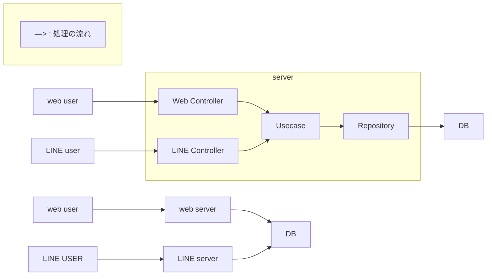

# LINE のボタン操作 × Web のワンタップログイン — Logbook 概要

筋トレの記録、もっと“ついで”に。Logbook は、LINE のボタン操作でトレーニングをサクッと記録し、Web では LINE OAuth でワンタップログインして履歴や進捗を確認できるアプリです。入力の手間と迷いを減らし、続けやすい習慣化を支援します。

## コアのポイント

- LINE で“ボタン”記録: リッチメニュー/クイックリプライから「記録する → 種目 → 重量 → 回数 → 保存」
- Web は LINE OAuth で“ワンタップ”ログイン: パスワード不要、すぐにダッシュボードへ
- クリーンアーキテクチャ: Web/LINE の入口は違っても、同じ Usecase/Repository で統一ロジック

## 使い方（かんたん 3 ステップ）

1. LINE で友だち追加
2. ボタンで記録: リッチメニューの「記録する」をタップ → 種目/重量/回数をボタンで選択 → 保存
3. Web は LINE でログイン: 「LINE でログイン」をタップ → ダッシュボードで履歴・グラフを確認

### ボタンフロー例（LINE）

- 記録の追加: 記録する → 種目（ベンチプレス/スクワット…）→ 重量（+5kg/−5kg/直接入力）→ 回数（+1/−1）→ 保存
- 今日の記録: 今日の記録 → 今日の一覧（Flex メッセージで見やすく表示）
- 今週の記録: 今週の記録 → 合計セット数/継続日数をカードで返信

## こんな人におすすめ

- 記録したいけど、毎回入力フォームを開くのが面倒
- 運動後の“流れ”で、そのまま記録まで終わらせたい
- 自分/チームの進捗を手軽に把握したいトレーナーやグループ

## 継続のための仕掛け

- ボタン主体で迷いなく素早く入力（ミスタップしても戻りやすい）
- 「今日/今週の記録」をワンタップで確認、小さな達成感を積み重ね
- 継続日数の通知でモチベーション維持

## Web でできること（管理者/チーム向け）

- LINE OAuth で即ログイン（パスワード不要）
- 自分/全ユーザーの記録を一覧・検索・分析
- 種目ごとの推移やボリュームの把握
- チームやクライアントの進捗をまとめて確認

## 開発の背景（ストーリー）

作者自身が「続けたいのに続かない」課題を抱え、記録の“面倒くささ”をなくすために着想。いつも使う LINE の中で完結させ、「筋トレを特別な行動ではなく、生活の一部にする」ことを目指して設計しました。テキスト入力に不慣れな場面でも迷いにくいよう、ボタン中心のフローに最適化しています。

## アプリ構成（クリーンアーキテクチャ）

Web と LINE の入口が違っても、内部では同じユースケース（Usecase）とリポジトリ（Repository）を利用します。UI を増やしてもビジネスロジックは共通のため、拡張しやすく、保守しやすい設計です。

## 今後の展望

- 体重・食事管理との連携、グラフ可視化の充実
- チーム/トレーナー機能の拡張
- 多言語対応（英語など）

---

## 技術のひとくちメモ（少しだけ）

- 認証: Web は LINE OAuth（セッション Cookie、`SameSite=None`/`Secure`）でログイン。LINE 側はボタン/ポストバックで記録指示
- 設計: クリーンアーキテクチャ（Controller → Usecase → Repository）。Web/LINE でビジネスロジックは共通
- データ: RDB + GORM。ユーザー/種目/ワークアウト/セット/体組成を中心に管理
- 参考: セットアップや補足は `README.md:1` を参照

---

気になった方は、ぜひ LINE のリッチメニューから“記録する”をタップして試してみてください。記録が“ついで”になると、筋トレはもっと続けやすくなります。
